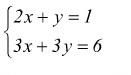

## g1. Le prime matrici non si scordano mai
Realizzare in octave le seguenti matrici

*A*

| 1 | 2 | 5 |
|:-:|:-:|:-:|
| 3 | 4 | 6 |

*B*
| 1 | 2 |
|:-:|:-:|
| 3 | 4 |
| 6 | 5 |

*C*
| 1 |
|:-:|
| 2 |
| 3 |
| 4 |
| 5 |

## g2. Operazioni con le matrici
Definite le seguenti matrici

*A*
| 1 | 2 | 5 |
|:-:|:-:|:-:|
| 3 | 4 | 6 |

*B*
| 1 | 2 |
|:-:|:-:|
| 3 | 4 |
| 6 | 5 |

*C*
| 7 | 8 | 0 |
|:-:|:-:|:-:|
| 10 | 11 | 12 |

Effettuare le seguenti operazioni
1. A + C
2. C - A
3. A*B
4. B*C

## g3. Il sistemino
Dato il seguente sistema lineare:

Definire:
* La matrice A dei coefficienti
* La matrice B dei termini noti

Trovare la soluzione del sistema e salvarla nella matrice C